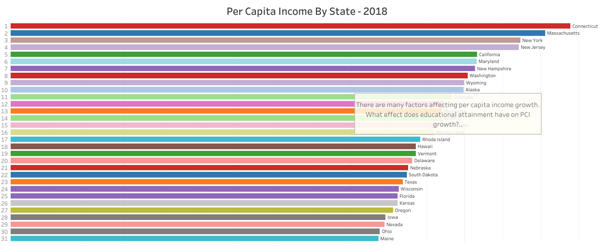
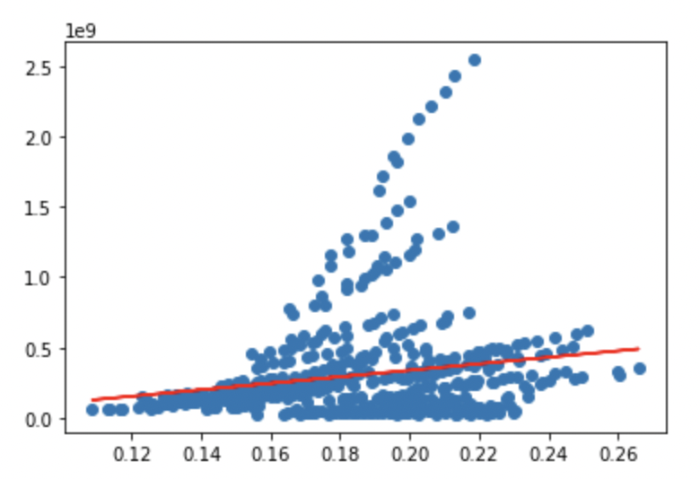

## Topic
Our topic is the effect of educational attainment on per capita income growth by state.

## Reason for Selecting Topic
We chose our topic because we were interested in how much of an effect education would have on income, not only on an individual level, but on a state level.

## Questions to Answer with the Data

- How does educational attainment affect per capita income growth in a state?
- What are the breakdowns of predicted per capita income growth by the following educational levels:

	- Less than 9th grade
	- 9th to 12th grade, no diploma
	- High school graduate
	- Some college, no degree
	- Associate's degree
	- Bachelor's degree
	- Graduate or professional degree

## Data Source

	- **Educational Attainment**, US Census, www.census.gov: American Community Survey, Selected Social Characteristics in the United States, 2019 link shown below: 
		- https://data.census.gov/cedsci/table?q=DP02&g=0100000US%240400000&tid=ACSDP1Y2019.DP02
	- **Per Capita Income by State**, Bureau of Economic Analysis, www.bea.gov: Regional Economic Accounts, Personal Income (State and Local), Annual Personal Income and Employment by State
		- https://apps.bea.gov/regional/downloadzip.cfm, SAINC5N_ALLAREAS_1998_2020.csv

## Data Exploration, Cleaning & Preprocessing

- Our original project idea was to see which factors could affect GDP growth between various countries of the world. As we discussed the idea, we decided that this topic might not be appropriate for our project given the limited timeframe to complete the project. Detailed data can be difficult to find for all countries. In addition, since we were dealing with financial data, we would have to add an additional layer of complexity by accounting for exchange rates between currencies. Given the time restraint for our project, we abandoned this idea.

- We then decided to investigate how per capita income (PCI) by U.S. state might be affected by different features. We soon realized that analyzing multiple features and 50 states over a range of years would be too broad to analyze well in this short-term project, so we decided to limit the project to one demographic feature. We needed to find data for both per capita income by state and features that could affect PCI.

- As discussed before, the team got the raw data from the following sources:

-	Per Capita Income by State from Bureau of Economic Analysis website https://apps.bea.gov/regional/downloadzip.cfm 
-	Educational attainment from United States Census Bureau
https://data.census.gov/cedsci/table?q=DP02&g=0100000US%240400000&tid=ACSDP1%20Y2019.DP02 

- Data was retrieved from these open government sources via API.

- For our datasets, we originally downloaded one .csv file with data on per capita income by state from 1998 to 2020 from the Bureau of Economic Analysis website (www.bea.gov). Educational attainment data was obtained by downloading individual Excel files for each year ranging from 2010 through 2019 from the American Community Survey data on the US census website (www.census.gov). 

- We initially cleaned the data manually so that we could explore the data and begin a rough draft of our machine learning model. After analyzing our initial machine learning model, it was determined that it would be helpful to find additional educational attainment data for years prior to 2005.

- We used an API to connect to the census.gov website to retrieve additional data for educational attainment from the American Community Survey. Unfortunately, data prior to 2005 was not available through the API, but we were able to obtain the additional years 2005-2009. 

- We also used the API to retrieve our original data that we had cleaned manually.
We used separate Jupyter notebook files for years 2005-2007 and 2008-2019 as the tables for the two date ranges differed slightly. 

- The data in both files was cleaned by converting objects to strings, dropping unnecessary columns, combining and reordering columns. The data was then exported into one final .csv file.

- During the data cleaning process, all the irrelevant data was removed, and our final data included only the features that would answer our analysis questions: “What is the effect of educational attainment on per capita income growth by state?” 

- To capture if a different education level of a population has a different effect on per capita income growth of a state, we have included data for all educational levels. 

- To see if there is consistency in the relationship of educational attainment and per capita income growth of a state over time, we decided to cover a decade and half worth of data.

- To analyze if educational attainment affects per capita income growth, we are analyzing data from all the 50 states in the country. 

- As part of the analysis, we used per capita income of every state for 15 years (the same years used for the educational attainment).

- Below is a sample visual representation of per capita income from all states.

## Initial Test of Data on Linear Regression Model

- To test the degree of an educational attainment effect on state’s per capita income, a linear regression model was used.

- From the preliminary results, a positive relationship was observed with some potential outliers that will be dealt later in the analysis.

- We did change our model once: At first, one singular machine learning model was trained on all data. However it was decided that for our purposes, we needed to run the model on each individual state. See an example linear regression plotted below (from linear_regression.ipynb)

- Results in the form of linear regression metrics like r2, coefficients and intercepts were output into json files, meant for easy processing into data visualization software Tableau. Some accuracy scores were better than others, as to be expected when running multiple models.

- Using the Linear Regression model, we did achieve our desired results. The limitations are of course that linear regression can only model one explanatory varible. If we wanted to include more than one, we would have to switch to a multiple linear regression. However, the benefits are that a linear regression is one of the simpler models, and thus was relatively simple to set up.

## Procedures

- Having clean data at hand, the next steps were:

	- To train the machine to predict per capita income of a state based on the educational attainment of that state’s population. We used SKLearn's linear regression module to train regressions in three tranches. The first measured the association between each of the seven levels of educational attainment and income without regard to the data's origination state. We then split the data by state, looping through each state and each education type to model the correlation between each level of education and income for each state. The third tranche of regressions used SKLearn's multivariate function to create combined models of education and income for each state. For each section of regressions, the data, r2, intercept, and slope variables were stored in a JSON-like nested list structure that could be loaded into modeling software.

	- To warehouse the data in a database, set a data pipeline that can be accessed down the road during the analysis.

	- To query a sub-set of our data if further analysis is needed in a selected state or region.

	- To further analyze the data in a visual format and build a dashboard/story out of it.

	- To write a comprehensive slide material that will be used for the team presentation.

	- To run a final assessment of the whole analysis and bring all moving parts to tell one cohesive story.

	- Last, but not least, is to present the findings our audiences and make few recommendations for further analysis.

## Technologies, Languages, Tools, and Algorithms
- Python 3.7.11
- Pandas 1.3.5
- Requests 2.26.0
- Censusdata 1.15
- Pathlib 2.3.6
- Matplotlib 3.5.0
- Sklearn 1.0
- Jupyter 1.0
- pgAdmin 5.7
- PostgreSQL
- Tableau Desktop 20.4.2
- Tableau Public
- Microsoft Excel 
- Google Drive, Docs, Slides

## Analysis

- During the test and train steps, a further data cleaning and formatting was done so that it fits the model. The data was comprehended into a series of nested dictionaries and key sets, which could be queried within loops. This allowed us to create models by splitting the data in different ways. For example, we were able to create models for each level of educational attainment both with and without regard to the data's state. We used loops and the dictionaries to automatically generate models for each state and each education level.

- As expected, the data from 50 states on multiple levels of educational attainment (7 categories to be exact) and covers 15 years was found complex.

- Regardless of the complexity, the model is predicting per capita income of a state based on educational attainment.

- A database engine is created and is ready to functionally take our data to PostgreSQL for further analysis.

- A preliminary dashboard and presentation materials are in place. 

### Links to Presentation in Google Slides and Tableau Storyboards

- <a href="https://docs.google.com/presentation/d/1XPAN1EF5-9N-P1rKqkQP-pZIE7t4LfmM8g94Y2baC9A/edit?usp=sharing">Google Slides Presentation<a>
- <a href="https://public.tableau.com/app/profile/vicky.carlson/viz/EffectofEducationalAttainmentonPerCapitaIncomeGrowth/Story1">Tableau Storyboard of PCI Growth and Educational Attainment Data<a>
- <a href="https://public.tableau.com/app/profile/yousief.beyene/viz/pci_growth/CoefsandRSQDashboard">Tableau Storyboard of PCI Growth Analysis Including Coefficient Indicators and R Squared Values<a>
